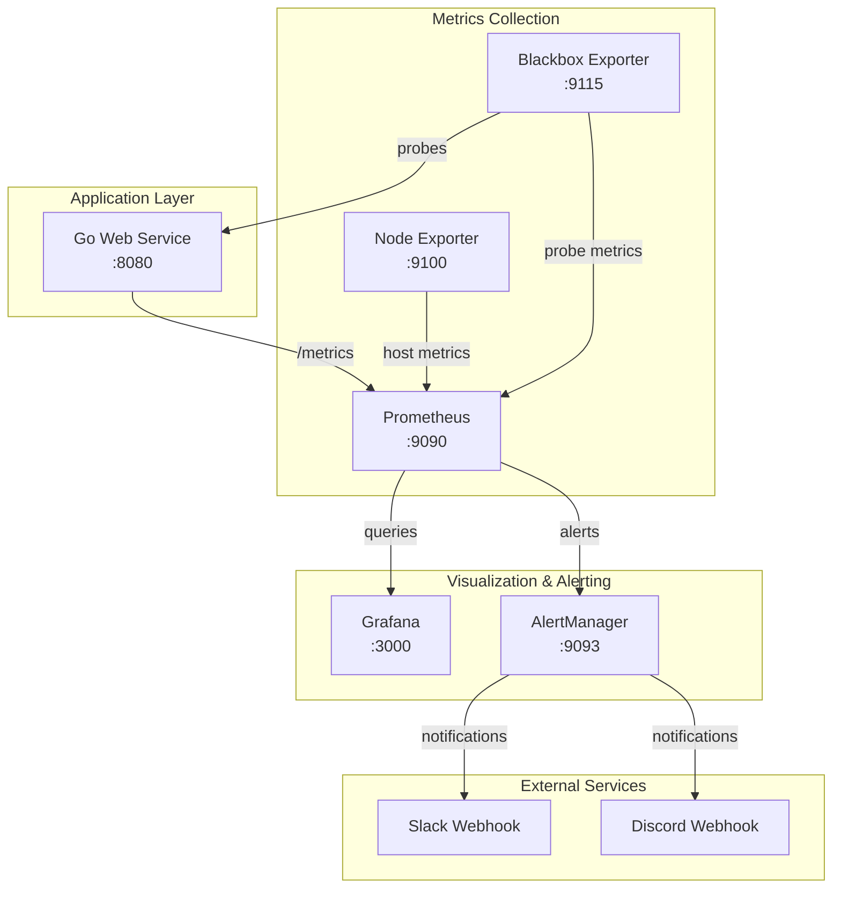

# Design Document

## Overview

The monitoring dashboard system is designed as a containerized observability stack that demonstrates production-ready monitoring patterns. The architecture follows the "Golden Signals" approach (latency, traffic, errors, saturation) and implements the Prometheus monitoring ecosystem with automated alerting capabilities.

The system consists of a Go web service that exposes Prometheus metrics, a complete observability stack running in Docker Compose, and automated alerting to external communication channels. The design emphasizes simplicity, reliability, and educational value for understanding modern monitoring practices.

## Architecture

### High-Level Architecture



### Component Interaction Flow

1. **Metrics Generation**: Go application instruments HTTP requests, business logic, and exposes /metrics endpoint
2. **Metrics Collection**: Prometheus scrapes metrics from app, node_exporter, and blackbox_exporter every 5 seconds
3. **Alert Evaluation**: Prometheus evaluates alert rules and fires alerts to AlertManager
4. **Notification Delivery**: AlertManager processes alerts and sends notifications to Slack/Discord
5. **Visualization**: Grafana queries Prometheus for dashboard data and displays real-time metrics

## Components and Interfaces

### Go Web Service

**Core Structure:**
```
cmd/api/main.go                 # Application entry point
internal/
├── config/config.go           # Configuration management
├── http/
│   ├── router.go             # Chi router setup
│   ├── handlers.go           # HTTP handlers
│   └── middleware.go         # Request middleware
├── metrics/prometheus.go      # Prometheus instrumentation
├── toggles/errors.go         # Error injection logic
└── health/readiness.go       # Health check logic
```

**Key Interfaces:**

1. **HTTP Endpoints:**
   - `GET /healthz` - Liveness probe (always returns 200)
   - `GET /readyz` - Readiness probe (checks dependencies)
   - `GET /metrics` - Prometheus metrics endpoint
   - `GET /api/v1/ping` - Simple ping endpoint
   - `GET /api/v1/work?ms=100&jitter=50` - Simulated work endpoint
   - `POST /api/v1/toggles/error-rate` - Error injection toggle (requires auth)

2. **Middleware Stack:**
   - Request ID generation and propagation
   - Structured logging with zap
   - Panic recovery with stack traces
   - Prometheus instrumentation (automatic)
   - Bearer token authentication (admin routes only)

3. **Configuration Interface:**
   ```go
   type Config struct {
       Port        string
       AdminToken  string
       LogLevel    string
       Environment string
   }
   ```

### Prometheus Configuration

**Scrape Configuration:**
```yaml
scrape_configs:
  - job_name: 'go-app'
    static_configs:
      - targets: ['go-app:8080']
    scrape_interval: 5s
    metrics_path: /metrics
    
  - job_name: 'node'
    static_configs:
      - targets: ['node_exporter:9100']
    scrape_interval: 5s
    
  - job_name: 'blackbox'
    static_configs:
      - targets: ['blackbox_exporter:9115']
    scrape_interval: 5s
```

**Alert Rules:**
- InstanceDown: `up{job=~"go-app|node"} == 0 for 2m`
- HighErrorRate: `rate(http_requests_total{status=~"5.."}[5m]) / rate(http_requests_total[5m]) > 0.02 for 10m`
- HighLatencyP95: `histogram_quantile(0.95, rate(http_request_duration_seconds_bucket[5m])) > 0.5 for 10m`
- UptimeProbeFail: `probe_success == 0 for 3m`

### Grafana Dashboard Design

**Dashboard Panels:**
1. **Service Overview** - Single stat panels showing service status
2. **Request Rate** - Time series of requests/second by route
3. **Error Rate** - Percentage of 4xx/5xx responses over time
4. **Latency Distribution** - P50, P95, P99 latency percentiles
5. **System Resources** - CPU, memory, disk usage from node_exporter
6. **Probe Status** - Blackbox probe success rates
7. **Top Routes** - Table of slowest endpoints
8. **Alert History** - Recent alert firing/resolution events

### AlertManager Configuration

**Routing Strategy:**
```yaml
route:
  group_by: ['alertname', 'instance']
  group_wait: 30s
  group_interval: 5m
  repeat_interval: 4h
  receiver: 'default'
  
receivers:
  - name: 'default'
    slack_configs:
      - api_url: '${SLACK_WEBHOOK_URL}'
        channel: '#alerts'
        title: 'Alert: {{ .GroupLabels.alertname }}'
    discord_configs:
      - webhook_url: '${DISCORD_WEBHOOK_URL}'
        title: 'Alert: {{ .GroupLabels.alertname }}'
```

## Data Models

### Metrics Schema

**HTTP Request Metrics:**
```
http_requests_total{method="GET", route="/api/v1/ping", status="200"} 1234
http_request_duration_seconds_bucket{method="GET", route="/api/v1/ping", le="0.1"} 1200
```

**Application Metrics:**
```
work_jobs_inflight 5
work_failures_total{operation="simulate_work"} 12
```

**System Metrics (from node_exporter):**
```
node_cpu_seconds_total{cpu="0", mode="user"} 12345.67
node_memory_MemAvailable_bytes 8589934592
```

**Probe Metrics (from blackbox_exporter):**
```
probe_success{instance="http://go-app:8080/healthz", job="blackbox"} 1
probe_duration_seconds{instance="http://go-app:8080/healthz", job="blackbox"} 0.123
```

### Configuration Data Model

**Environment Variables:**
```
APP_PORT=8080
ADMIN_TOKEN=changeme
SLACK_WEBHOOK_URL=https://hooks.slack.com/...
DISCORD_WEBHOOK_URL=https://discord.com/api/webhooks/...
BLACKBOX_TARGET_1=http://go-app:8080/healthz
BLACKBOX_TARGET_2=https://example.com
GRAFANA_ADMIN_USER=admin
GRAFANA_ADMIN_PASSWORD=admin
```

## Error Handling

### Application Error Handling

1. **Panic Recovery**: Middleware catches panics, logs stack trace, returns 500
2. **Graceful Degradation**: Health checks fail gracefully when dependencies unavailable
3. **Circuit Breaker Pattern**: Error injection can be toggled to simulate failures
4. **Timeout Handling**: Work simulation respects context cancellation

### Monitoring Error Handling

1. **Scrape Failures**: Prometheus continues with stale data, alerts on scrape failures
2. **Alert Delivery**: AlertManager retries failed webhook deliveries with exponential backoff
3. **Dashboard Resilience**: Grafana shows "No Data" instead of crashing on query failures
4. **Probe Failures**: Blackbox exporter distinguishes between network and application failures

### Error Injection Strategy

```go
type ErrorToggle struct {
    Enabled    bool
    Rate       float64  // 0.0 to 1.0
    StatusCode int      // HTTP status to return
}
```

Error injection affects:
- HTTP response status codes
- Response latency simulation
- Work operation failures
- Health check responses (optional)

## Testing Strategy

### Unit Testing

1. **Handler Testing**: Test HTTP handlers with httptest.ResponseRecorder
2. **Middleware Testing**: Verify middleware behavior in isolation
3. **Metrics Testing**: Assert Prometheus metrics are recorded correctly
4. **Configuration Testing**: Test environment variable parsing and defaults

### Integration Testing

1. **Health Endpoint Testing**: Verify health checks work end-to-end
2. **Metrics Scraping**: Test Prometheus can scrape application metrics
3. **Alert Rule Testing**: Verify alert rules fire under expected conditions
4. **Dashboard Testing**: Ensure Grafana can query and display metrics

### Load Testing

**Vegeta Load Test Configuration:**
```bash
echo "GET http://localhost:8080/api/v1/work?ms=100&jitter=50" | \
  vegeta attack -duration=5m -rate=50 | \
  vegeta report
```

**Test Scenarios:**
1. **Baseline Load**: 50 RPS for 5 minutes to establish baseline metrics
2. **Latency Spike**: High ms parameter to trigger p95 latency alerts
3. **Error Injection**: Toggle error rate to trigger error alerts
4. **Instance Failure**: Stop container to trigger down alerts

### Demo Validation

**Acceptance Criteria Verification:**
1. All containers start successfully with `docker-compose up -d`
2. Grafana dashboards populate with data within 30 seconds
3. Load testing triggers latency alerts within 10 minutes
4. Error injection triggers error rate alerts within 10 minutes
5. Container shutdown triggers instance down alerts within 2 minutes
6. All alerts resolve when conditions return to normal
7. Webhook notifications are delivered to Slack/Discord

**Performance Targets:**
- Application handles 200 RPS on laptop hardware
- P95 latency < 300ms under normal load
- Error rate < 1% under normal conditions
- 99.5% uptime SLO (simulated over demo period)

### Monitoring the Monitoring

**Meta-monitoring Metrics:**
- Prometheus scrape success rates
- AlertManager notification delivery success
- Grafana query performance
- Container resource usage
- Webhook response times

This design provides a comprehensive foundation for implementing a production-ready monitoring system that demonstrates modern observability practices while remaining simple enough for educational and demonstration purposes.