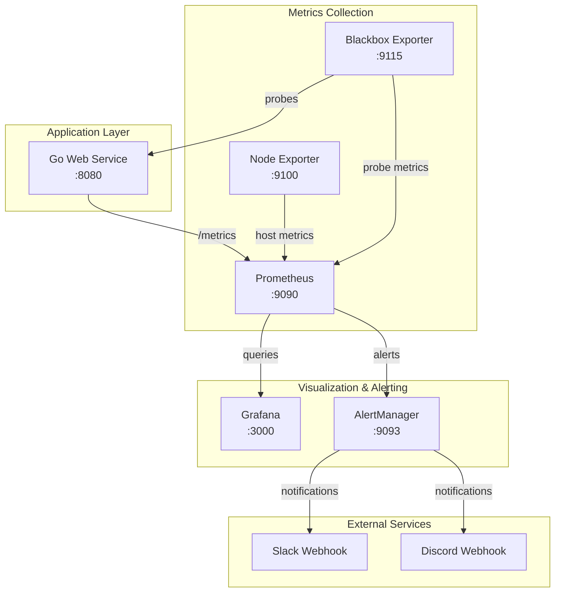

# Monitoring Dashboard Automation

A production-style monitoring system that demonstrates comprehensive observability patterns using Go, Prometheus, Grafana, and AlertManager. This system exposes metrics from a Go web service, visualizes them with Grafana dashboards, and triggers automated alerts to Slack/Discord when performance thresholds are breached.

## 🚀 Quick Start

1. **Clone and setup**:
   ```bash
   git clone <repository-url>
   cd monitoring-dashboard-automation
   cp .env.example .env
   ```

2. **Start the monitoring stack**:
   ```bash
   make run
   # or
   docker-compose up -d
   ```

3. **Access the services**:
   - **Application**: http://localhost:8080
   - **Grafana**: http://localhost:3000 (admin/admin)
   - **Prometheus**: http://localhost:9090
   - **AlertManager**: http://localhost:9093

4. **Run a demo**:
   ```bash
   make demo
   ```

## 📋 Table of Contents

- [Features](#-features)
- [Architecture](#-architecture)
- [Project Structure](#-project-structure)
- [Prerequisites](#-prerequisites)
- [Installation](#-installation)
- [Configuration](#-configuration)
- [Usage](#-usage)
- [API Endpoints](#-api-endpoints)
- [Monitoring Stack](#-monitoring-stack)
- [Dashboards](#-dashboards)
- [Alerting](#-alerting)
- [Testing](#-testing)
- [Load Testing](#-load-testing)
- [Troubleshooting](#-troubleshooting)
- [Contributing](#-contributing)

## ✨ Features

### Core Application
- **Go Web Service** with Chi router and structured logging
- **Health Endpoints** (`/healthz`, `/readyz`) for Kubernetes-style health checks
- **Prometheus Metrics** with automatic HTTP instrumentation
- **Work Simulation** endpoint for load testing and latency simulation
- **Error Injection** system for testing alerting and monitoring
- **Graceful Shutdown** with proper signal handling

### Monitoring & Observability
- **Prometheus** metrics collection with 5-second scrape intervals
- **Grafana** dashboards with comprehensive service monitoring
- **AlertManager** with Slack/Discord webhook notifications
- **Blackbox Exporter** for external uptime monitoring
- **Node Exporter** for system metrics collection

### Testing & Demo
- **Comprehensive Test Suite** (unit + integration tests)
- **Load Testing Scripts** using Vegeta
- **Demo Scenarios** for showcasing monitoring capabilities
- **Error Injection** for testing alert conditions
- **Automated CI/CD** integration support

## 🏗 Architecture



## 📁 Project Structure

```
.
├── cmd/
│   └── api/
│       └── main.go                    # Application entry point
├── internal/
│   ├── config/
│   │   └── config.go                 # Configuration management
│   ├── http/
│   │   ├── router.go                 # Chi router setup
│   │   ├── handlers.go               # HTTP handlers
│   │   └── middleware.go             # Request middleware
│   ├── metrics/
│   │   └── prometheus.go             # Prometheus instrumentation
│   ├── toggles/
│   │   └── errors.go                 # Error injection logic
│   └── health/
│       └── readiness.go              # Health check logic
├── prometheus/
│   ├── prometheus.yml                # Prometheus configuration
│   └── alerts.yml                    # Alert rules
├── grafana/
│   └── provisioning/
│       ├── datasources/              # Datasource configuration
│       └── dashboards/               # Dashboard definitions
├── alertmanager/
│   └── alertmanager.yml              # AlertManager configuration
├── blackbox/
│   └── blackbox.yml                  # Blackbox exporter configuration
├── scripts/
│   ├── demo-scenario.sh              # Complete demo script
│   ├── load-test-*.sh                # Load testing scripts
│   └── trigger-*-alerts.sh           # Alert testing scripts
├── docker-compose.yml                # Complete monitoring stack
├── Makefile                          # Build and test targets
├── .env.example                      # Environment configuration template
└── README.md                         # This file
```

## 📋 Prerequisites

### Required Software
- **Docker** (20.10+) and **Docker Compose** (2.0+)
- **Go** (1.21+) for local development
- **Make** (optional, for convenience targets)

### Optional Tools (for load testing)
- **Vegeta** - HTTP load testing tool
- **jq** - JSON processor for parsing results
- **bc** - Basic calculator for mathematical operations

### System Requirements
- **CPU**: 2+ cores recommended
- **Memory**: 4GB+ RAM recommended
- **Disk**: 2GB+ free space for images and data
- **Ports**: 3000, 8080, 9090, 9093, 9100, 9115 must be available

## 🔧 Installation

### Using Docker (Recommended)

1. **Clone the repository**:
   ```bash
   git clone <repository-url>
   cd monitoring-dashboard-automation
   ```

2. **Configure environment**:
   ```bash
   cp .env.example .env
   # Edit .env with your webhook URLs and preferences
   ```

3. **Start the stack**:
   ```bash
   make run
   # or
   docker-compose up -d
   ```

### Local Development

1. **Install Go dependencies**:
   ```bash
   go mod tidy
   ```

2. **Build the application**:
   ```bash
   make build
   # or
   go build -o bin/api ./cmd/api
   ```

3. **Run locally**:
   ```bash
   ./bin/api
   # or
   go run cmd/api/main.go
   ```

## ⚙️ Configuration

### Environment Variables

Copy `.env.example` to `.env` and customize:

#### Application Configuration
| Variable | Default | Description |
|----------|---------|-------------|
| `APP_PORT` | `8080` | Application HTTP port |
| `ADMIN_TOKEN` | `changeme` | Bearer token for admin endpoints |
| `LOG_LEVEL` | `info` | Logging level (debug, info, warn, error) |
| `ENVIRONMENT` | `development` | Environment name for logging |

#### Webhook Configuration
| Variable | Default | Description |
|----------|---------|-------------|
| `SLACK_WEBHOOK_URL` | - | Slack webhook URL for alert notifications |
| `DISCORD_WEBHOOK_URL` | - | Discord webhook URL for alert notifications |

#### Blackbox Exporter Targets
| Variable | Default | Description |
|----------|---------|-------------|
| `BLACKBOX_INTERNAL_TARGET_1` | `http://go-app:8080/healthz` | Internal health check endpoint |
| `BLACKBOX_INTERNAL_TARGET_2` | `http://go-app:8080/readyz` | Internal readiness endpoint |
| `BLACKBOX_INTERNAL_TARGET_3` | `http://go-app:8080/api/v1/ping` | Internal API endpoint |
| `BLACKBOX_EXTERNAL_TARGET_1` | `https://httpbin.org/status/200` | External test endpoint |
| `BLACKBOX_EXTERNAL_TARGET_2` | `https://example.com` | External website |
| `BLACKBOX_EXTERNAL_TARGET_3` | `https://google.com` | External website |

#### Grafana Configuration
| Variable | Default | Description |
|----------|---------|-------------|
| `GRAFANA_ADMIN_USER` | `admin` | Grafana admin username |
| `GRAFANA_ADMIN_PASSWORD` | `admin` | Grafana admin password |

#### Prometheus Configuration
| Variable | Default | Description |
|----------|---------|-------------|
| `PROMETHEUS_RETENTION_TIME` | `15d` | How long to keep metrics data |
| `PROMETHEUS_SCRAPE_INTERVAL` | `5s` | How often to scrape metrics |

#### AlertManager Configuration
| Variable | Default | Description |
|----------|---------|-------------|
| `ALERT_GROUP_WAIT` | `30s` | Wait time before sending grouped alerts |
| `ALERT_GROUP_INTERVAL` | `5m` | Interval between grouped alert batches |
| `ALERT_REPEAT_INTERVAL` | `4h` | How often to repeat firing alerts |

### Webhook Configuration

To receive alert notifications:

1. **Slack Setup**:
   - Create a Slack app and incoming webhook
   - Set `SLACK_WEBHOOK_URL` in `.env`

2. **Discord Setup**:
   - Create a Discord webhook in your server
   - Set `DISCORD_WEBHOOK_URL` in `.env`

3. **Restart AlertManager**:
   ```bash
   docker-compose restart alertmanager
   ```

## 🎯 Usage

### Make Targets

| Target | Description |
|--------|-------------|
| `make help` | Show all available targets |
| `make build` | Build the Go application |
| `make test` | Run all tests (unit + integration) |
| `make test-unit` | Run unit tests only |
| `make test-integration` | Run integration tests |
| `make run` | Start the monitoring stack |
| `make clean` | Stop and clean up the stack |
| `make demo` | Run complete demo scenario |
| `make load-test-baseline` | Run baseline load test |
| `make load-test-latency` | Run latency spike test |
| `make load-test-errors` | Run error injection test |
| `make check-deps` | Check required dependencies |

### Basic Operations

```bash
# Start the monitoring stack
make run

# Check service health
curl http://localhost:8080/healthz

# Generate some traffic
curl "http://localhost:8080/api/v1/work?ms=100&jitter=50"

# View metrics
curl http://localhost:8080/metrics

# Run load tests
make load-test-baseline

# Stop everything
make clean
```

## 🔌 API Endpoints

### Health Endpoints
- `GET /healthz` - Liveness probe (always returns 200 OK)
- `GET /readyz` - Readiness probe with dependency checks
- `GET /metrics` - Prometheus metrics endpoint

### Application Endpoints
- `GET /api/v1/ping` - Simple ping endpoint
- `GET /api/v1/work?ms=100&jitter=50` - Work simulation endpoint
  - `ms`: Work duration in milliseconds
  - `jitter`: Random jitter in milliseconds

### Admin Endpoints (require Bearer token)
- `POST /api/v1/toggles/error-rate` - Enable/disable error injection
  ```bash
  curl -X POST \
    -H "Authorization: Bearer changeme" \
    -H "Content-Type: application/json" \
    -d '{"enabled": true, "rate": 0.1, "status_code": 500}' \
    http://localhost:8080/api/v1/toggles/error-rate
  ```

## 📊 Monitoring Stack

### Services Overview

| Service | Port | Purpose | Health Check |
|---------|------|---------|--------------|
| Go App | 8080 | Main application | `/healthz` |
| Prometheus | 9090 | Metrics collection | `/-/healthy` |
| Grafana | 3000 | Visualization | `/api/health` |
| AlertManager | 9093 | Alert routing | `/-/healthy` |
| Node Exporter | 9100 | System metrics | `/metrics` |
| Blackbox Exporter | 9115 | Uptime probes | `/metrics` |

### Key Metrics Collected

**HTTP Metrics**:
- `http_requests_total` - Total HTTP requests by method, route, status
- `http_request_duration_seconds` - Request latency histogram

**Application Metrics**:
- `work_jobs_inflight` - Number of active work jobs
- `work_failures_total` - Total work operation failures

**System Metrics**:
- `go_goroutines` - Number of goroutines
- `process_cpu_seconds_total` - CPU usage
- `process_resident_memory_bytes` - Memory usage

**Probe Metrics**:
- `probe_success` - Probe success status
- `probe_duration_seconds` - Probe response time

## 📈 Dashboards

### Grafana Dashboard Panels

1. **Service Overview** - Service up/down status
2. **Request Rate** - Requests per second by route
3. **Error Rate** - Percentage of 4xx/5xx responses
4. **Latency Distribution** - P50, P95, P99 percentiles
5. **System Resources** - CPU, memory, disk usage
6. **Probe Status** - External uptime monitoring
7. **Top Routes** - Slowest endpoints by latency
8. **Alert History** - Recent alert events

### Dashboard Screenshots

#### Grafana Main Dashboard

*Complete monitoring dashboard showing service metrics, request rates, error rates, and system resources*

#### Service Overview Panels

*Service status indicators and key performance metrics*

#### Prometheus Targets

*Prometheus scrape targets showing health status of all monitored services*

#### AlertManager Interface

*AlertManager interface showing alert routing and notification status*

*Note: To generate these screenshots, run `make run` followed by `make load-test-baseline` and access the services at their respective URLs*

## 🚨 Alerting

### Alert Rules

| Alert | Condition | Duration | Description |
|-------|-----------|----------|-------------|
| **InstanceDown** | `up{job=~"go-app\|node"} == 0` | 2 minutes | Service instance is down |
| **HighErrorRate** | `5xx error rate > 2%` | 10 minutes | High rate of server errors |
| **HighLatencyP95** | `p95 latency > 500ms` | 10 minutes | High response latency |
| **UptimeProbeFail** | `probe_success == 0` | 3 minutes | External probe failure |

### Alert Notification Examples

#### Slack Notification

*Example Slack notification when HighErrorRate alert fires*

#### Discord Notification

*Example Discord notification showing alert details and resolution*

#### Webhook Payload Structure
```json
{
  "receiver": "default",
  "status": "firing",
  "alerts": [
    {
      "status": "firing",
      "labels": {
        "alertname": "HighErrorRate",
        "instance": "go-app:8080",
        "job": "go-app",
        "severity": "warning"
      },
      "annotations": {
        "description": "Error rate is 5.2% for the last 10 minutes",
        "summary": "High error rate detected"
      }
    }
  ]
}
```

## 🧪 Testing

### Unit Tests

Run unit tests for individual components:
```bash
make test-unit
# or
go test -v -short ./...
```

**Coverage includes**:
- HTTP handlers and middleware
- Metrics instrumentation
- Error injection logic
- Health check functionality
- Configuration management

### Integration Tests

Run comprehensive end-to-end tests:
```bash
make test-integration
# or
./scripts/run-integration-tests.sh
```

**Test scenarios**:
- Service startup and health checks
- Prometheus scraping and metrics collection
- Grafana datasource and query functionality
- Alert rule evaluation and firing
- Webhook notification delivery
- Error injection and recovery

**Duration**: 15-20 minutes

For detailed information, see [INTEGRATION_TESTS.md](INTEGRATION_TESTS.md).

## 🔥 Load Testing

### Available Load Tests

| Script | Purpose | Duration | Expected Result |
|--------|---------|----------|-----------------|
| `load-test-baseline.sh` | Normal traffic baseline | 5 min | P95 < 300ms, errors < 1% |
| `load-test-latency-spike.sh` | Trigger latency alerts | 12 min | P95 > 500ms, HighLatencyP95 alert |
| `load-test-errors.sh` | Trigger error alerts | 12 min | Error rate > 2%, HighErrorRate alert |
| `trigger-instance-down-alerts.sh` | Test instance failure | 3 min | InstanceDown alert |

### Running Load Tests

```bash
# Install vegeta (if not already installed)
# macOS: brew install vegeta
# Linux: Download from GitHub releases

# Run baseline test
make load-test-baseline

# Run latency spike test
make load-test-latency

# Run error injection test
make load-test-errors

# Run complete demo
make demo
```

### Load Test Results

Results are saved in `./load-test-results/`:
- `*-report.txt` - Human-readable summary
- `*-report.json` - Machine-readable results
- `*-histogram.txt` - Latency distribution

Example output:
```
Requests      [total, rate, throughput]         15000, 50.00, 49.98
Duration      [total, attack, wait]             5m0s, 5m0s, 2.1ms
Latencies     [min, mean, 50, 90, 95, 99, max]  1.2ms, 45.3ms, 42.1ms, 78.2ms, 95.4ms, 145.2ms, 234.5ms
Bytes In      [total, mean]                     345000, 23.00
Bytes Out     [total, mean]                     0, 0.00
Success       [ratio]                           99.87%
Status Codes  [code:count]                      200:14980  500:20
```

## 🔧 Troubleshooting

### Common Issues

#### Services Not Starting
```bash
# Check service status
docker-compose ps

# View service logs
docker-compose logs go-app
docker-compose logs prometheus
docker-compose logs grafana

# Check port conflicts
netstat -tulpn | grep :8080
```

#### Metrics Not Appearing
```bash
# Check Prometheus targets
curl http://localhost:9090/api/v1/targets

# Verify application metrics
curl http://localhost:8080/metrics | grep http_requests_total

# Check Prometheus configuration
docker-compose exec prometheus cat /etc/prometheus/prometheus.yml
```

#### Alerts Not Firing
```bash
# Check alert rules
curl http://localhost:9090/api/v1/rules

# View active alerts
curl http://localhost:9090/api/v1/alerts

# Check AlertManager status
curl http://localhost:9093/api/v1/status
```

#### Dashboard Empty
```bash
# Test Grafana-Prometheus connection
curl -u admin:admin http://localhost:3000/api/datasources

# Check Grafana logs
docker-compose logs grafana

# Verify dashboard provisioning
docker-compose exec grafana ls -la /etc/grafana/provisioning/dashboards/
```

#### Load Tests Failing
```bash
# Check vegeta installation
vegeta -version

# Verify application is responding
curl http://localhost:8080/healthz

# Check admin token for error injection
export ADMIN_TOKEN="changeme"
curl -H "Authorization: Bearer $ADMIN_TOKEN" \
     -X POST http://localhost:8080/api/v1/toggles/error-rate
```

### Performance Tuning

#### Resource Limits
```yaml
# docker-compose.yml
services:
  go-app:
    deploy:
      resources:
        limits:
          memory: 512M
          cpus: '0.5'
```

#### Prometheus Configuration
```yaml
# prometheus/prometheus.yml
global:
  scrape_interval: 15s  # Reduce for less frequent scraping
  evaluation_interval: 15s

rule_files:
  - "alerts.yml"

scrape_configs:
  - job_name: 'go-app'
    scrape_interval: 5s  # High frequency for demo
```

### Debug Mode

Enable debug logging:
```bash
# Set environment variable
export LOG_LEVEL=debug

# Or update .env file
echo "LOG_LEVEL=debug" >> .env

# Restart services
docker-compose restart go-app
```

### Health Check Commands

```bash
# Application health
curl -f http://localhost:8080/healthz || echo "App unhealthy"

# Prometheus health
curl -f http://localhost:9090/-/healthy || echo "Prometheus unhealthy"

# Grafana health
curl -f http://localhost:3000/api/health || echo "Grafana unhealthy"

# AlertManager health
curl -f http://localhost:9093/-/healthy || echo "AlertManager unhealthy"
```

### Log Analysis

```bash
# View all service logs
docker-compose logs -f

# Filter specific service logs
docker-compose logs -f go-app | grep ERROR

# Export logs for analysis
docker-compose logs --no-color > monitoring-logs.txt
```

## 🤝 Contributing

### Development Setup

1. **Fork and clone the repository**
2. **Create a feature branch**:
   ```bash
   git checkout -b feature/your-feature-name
   ```
3. **Make changes and test**:
   ```bash
   make test
   ```
4. **Submit a pull request**

### Code Style

- Follow Go conventions and use `gofmt`
- Add unit tests for new functionality
- Update documentation for API changes
- Use structured logging with appropriate levels

### Testing Requirements

- All new code must have unit tests
- Integration tests must pass
- Load tests should demonstrate new features
- Documentation must be updated

## 📚 Additional Documentation

- [DEMO_GUIDE.md](DEMO_GUIDE.md) - Complete demo instructions
- [INTEGRATION_TESTS.md](INTEGRATION_TESTS.md) - Integration test details
- [DOCKER_SETUP.md](DOCKER_SETUP.md) - Docker Compose configuration
- [CONFIGURATION.md](CONFIGURATION.md) - Comprehensive configuration guide
- [BLACKBOX_CONFIGURATION.md](BLACKBOX_CONFIGURATION.md) - Blackbox exporter setup
- [TROUBLESHOOTING.md](TROUBLESHOOTING.md) - Comprehensive troubleshooting guide

## 📄 License

This project is licensed under the MIT License - see the LICENSE file for details.

## 🙏 Acknowledgments

- [Prometheus](https://prometheus.io/) - Monitoring and alerting toolkit
- [Grafana](https://grafana.com/) - Visualization and analytics platform
- [Chi](https://github.com/go-chi/chi) - Lightweight HTTP router
- [Vegeta](https://github.com/tsenart/vegeta) - HTTP load testing tool

---

**Built with ❤️ for demonstrating production-ready monitoring patterns**